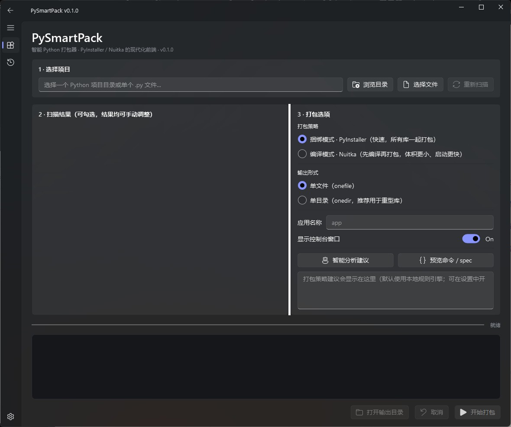
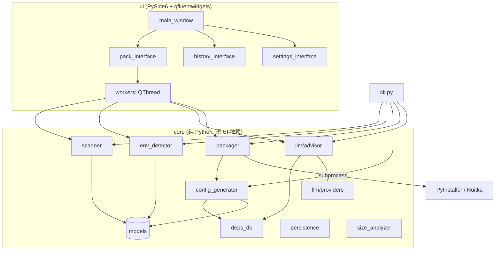

# PySmartPack · 智能 Python 打包器

 **中文** · [English](./README_EN.md)

📖 [设计规范 DESIGN.md](./DESIGN.md)


> 给 PyInstaller / Nuitka 装一个**会思考的现代化前端**。
> 选中一个 Python 目录 → 自动识别结构 / 环境 / 依赖 / 数据 → 一键打包成可执行文件。

<p>


</p>

PySmartPack 不是又一个打包引擎，而是 PyInstaller / Nuitka 的**智能配置前端**——类比 *Docker Desktop 之于 Docker CLI*。
它把"配置 .spec / 处理隐藏依赖 / 收集数据文件"这些长期痛点自动化，并保留**所有自动识别结果均可手动修改**的原则，绝不静默替你做决定。

---

## 目录

- [🚀 如何运行（先看这里）](#-如何运行先看这里)
- [它解决什么问题](#它解决什么问题)
- [核心特性](#核心特性)
- [界面预览](#界面预览)
- [工作原理 / 架构](#工作原理--架构)
- [数据透明与隐私](#数据透明与隐私)（**重点**）
- [安装](#安装)
- [使用](#使用)
  - [图形界面 (GUI)](#图形界面-gui)
  - [命令行 (CLI)](#命令行-cli)
- [支持的识别能力](#支持的识别能力)
- [LLM 智能顾问](#llm-智能顾问可选)
- [项目结构](#项目结构)
- [开发与测试](#开发与测试)
- [构建便携版 / 发布](#构建便携版--发布)
- [路线图](#路线图)
- [常见问题 FAQ](#常见问题-faq)
- [贡献](#贡献)
- [许可证](#许可证)
- [更新日志](#更新日志)

> 相关文档：界面/配色规范见 [DESIGN.md](./DESIGN.md)（[English](./DESIGN_EN.md)）。

---

## 🚀 如何运行（先看这里）

> PySmartPack 本身就提供**零依赖的便携版**——像 mpv 一样，下载解压双击即用，**最终用户无需安装 Python**。

### 方式 A · 最终用户：下载即用（推荐）
1. 从 Releases 下载 `PySmartPack_portable.zip`（约 **50 MB**）。
2. 解压到任意目录。
3. 双击文件夹内的 **`PySmartPack.exe`** → 直接打开图形界面。**无需 Python、无需任何依赖。**

> 想自己生成这个 zip？见 [构建便携版 / 发布](#构建便携版--发布)（一条命令）。

### 方式 B · 开发者：从源码运行
- **Windows**：双击仓库根目录的 **`run.bat`**（首次自动建虚拟环境并装依赖，之后直接启动界面）。
- **macOS / Linux**：`bash run.sh`
- **手动**：
  ```bash
  python -m venv .venv
  .venv\Scripts\activate          # Windows（macOS/Linux: source .venv/bin/activate）
  pip install -r requirements.txt
  python -m pysmartpack            # 启动图形界面
  ```

---

## 它解决什么问题

PyInstaller 强大但配置繁琐，社区长期痛点包括：

| 痛点 | 传统做法 | PySmartPack |
|---|---|---|
| 不知道哪个文件是入口 | 手动指定 | 静态分析 `if __name__ == "__main__"` 并打分排序 |
| 数据文件（xlsx/npz/json…）漏打包 | 手写 `--add-data` | 按扩展名自动分类、默认全选、可勾选取消 |
| 用了虚拟环境/Conda 却打包错依赖 | 手动激活环境 | 自动探测 venv/conda/poetry 并定位其解释器 |
| 动态导入 / C 扩展被遗漏 | 报错后逐个排查 | AST 检测动态导入、扫描 `.dll/.so/.pyd` 并预警 |
| 重型库（torch 等）打包失败 | Google + 试错 | 内置依赖知识库自动注入 `--collect-all` 等修复 |
| 看不懂打包命令 | 黑盒 | 一键**预览** CLI 参数与 `.spec` 文件 |

---

## 核心特性

按里程碑组织，三个里程碑均已实现。

### M1 · 核心打包链路（端到端可用）
- **现代 Fluent 界面**：基于 PySide6 + qfluentwidgets，深色主题、Linear 风格设计令牌（见 [DESIGN.md](./DESIGN.md)）。
- **项目扫描器**：入口点检测、包结构、数据文件分类、动态导入与 C 扩展检测（纯 `ast`，不执行目标代码）。
- **环境探测器**：venv / `.venv` / conda / poetry / pipenv 识别，优先用项目自身解释器 `pip list` 解析真实依赖。
- **配置生成器**：自动生成 PyInstaller 参数 / `.spec`，自动把数据文件转 `--add-data`、二进制转 `--add-binary`。
- **打包执行器**：子进程驱动后端，实时解析 stdout → 进度条 + 彩色日志，支持取消。
- **打包策略二选一**：`捆绑模式 (PyInstaller)` 或 `编译模式 (Nuitka)`；输出 `单文件 / 单目录`。

### M2 · 智能差异化
- **依赖知识库 (`deps_db`)**：内置 numpy/pandas/scipy/sklearn/matplotlib/torch/tensorflow/opencv/PySide6/qfluentwidgets 等常见库的打包修复规则（hidden-import、collect-all、onedir 建议）。
- **LLM 智能顾问（默认关闭）**：分析项目摘要，给出后端/输出形式/隐藏依赖/数据策略建议；**默认优先 DeepSeek**，同时支持 OpenAI / Anthropic / Ollama；**离线或失败时自动回退本地规则引擎**。
- **Nuitka 后端**：可选编译模式。

### M3 · 打磨
- **配置 / 历史持久化**：最近项目、默认选项、LLM 配置存于本机；打包历史可查看/清空。
- **产物体积分析**：打包完成后列出各子目录/文件体积占比，定位"谁把包撑大了"。
- **便携版构建**：内置一键构建脚本 `scripts/build_app.py`，把 PySmartPack 打包成零依赖便携版（详见 [构建便携版 / 发布](#构建便携版--发布)）。

---

## 界面预览



界面分三页（左侧 Fluent 导航）：

- **打包**：① 选择项目 → ② 可勾选的扫描结果树 → ③ 打包选项 + 智能建议 → 进度条 + 彩色日志 → 开始打包 / 取消 / 打开输出目录 / 预览命令。
- **历史**：表格列出最近打包任务（名称 / 后端 / 结果 / 耗时 / 项目）。
- **设置**：LLM 顾问开关与凭据、深色/浅色主题。

---

## 工作原理 / 架构

**严格分层**：`core` 为纯 Python、零 UI 依赖，可被 GUI / CLI / CI 复用并独立单测；`ui` 单向依赖 `core`。



### 模块职责

| 模块 | 职责 | 关键技术 |
|---|---|---|
| `core/scanner.py` | 扫描项目结构、入口、数据文件、import 链、动态导入、C 扩展 | `ast`、`pathlib`（**只读不执行**） |
| `core/env_detector.py` | 识别虚拟环境并解析依赖列表 | `pyvenv.cfg`、`pip list`、`pyproject.toml`、`poetry env info` |
| `core/deps_db.py` | 常见库打包陷阱知识库 | 规则表 |
| `core/config_generator.py` | 扫描结果 → `PackConfig` → CLI 参数 / `.spec` / Nuitka 命令 | 模板化渲染 |
| `core/packager.py` | 子进程执行后端、进度解析、取消、定位产物、选择解释器 | `subprocess.Popen` |
| `core/llm/` | 可选 LLM 顾问 + 规则回退（DeepSeek/OpenAI/Anthropic/Ollama） | stdlib `urllib` HTTP |
| `core/persistence.py` | 设置 / 历史本地持久化 | JSON @ 用户配置目录 |
| `core/size_analyzer.py` | 产物体积分析 | 文件系统遍历 |
| `ui/*` | Fluent 界面与 `QThread` 工作线程 | PySide6、qfluentwidgets |

### 一次打包的数据流

```
选目录
  → scanner.scan_project(path)        →  ScanResult（入口/包/数据/import/动态导入/C扩展）
  → env_detector.detect_env(root)     →  EnvInfo（环境类型/解释器/依赖）
  → llm.get_advice(scan, llm_cfg)     →  Advice（建议；默认走本地规则）
  → config_generator.build_pack_config(...)  →  PackConfig（含 add_data / hidden_imports / collect_*）
  → config_generator.render(cfg)      →  {args, spec}  ← "预览"按钮展示的就是这个
  → packager.Packager(cfg).run(...)   →  subprocess 调用 PyInstaller/Nuitka
                                       →  实时日志 + 进度回调
                                       →  PackResult（成功/产物路径/耗时）
  → size_analyzer.analyze(output)     →  体积报告
  → persistence.add_history(...)      →  写入本地历史
```

---

## 数据透明与隐私

PySmartPack 的设计原则：**默认本地、默认离线、绝不静默上传代码。**

### 各类数据去向一览

| 数据 | 是否离开本机 | 说明 |
|---|---|---|
| 你的源代码内容 | **从不** | 扫描器只做 `ast` 静态解析，源代码**不写日志、不上传**。 |
| 项目结构摘要 | 仅当你**手动开启 LLM** 时 | 见下方"发送给 LLM 的具体字段"。 |
| 依赖列表 / import 名 | 仅当开启 LLM | 仅模块/依赖**名称**。 |
| LLM API Key | **从不离开本机**（除直连你配置的 API 端点） | 明文保存在本地配置文件，仅用于请求头鉴权；日志中始终以 `***` 脱敏。 |
| 设置 / 历史记录 | **从不** | JSON 存于用户配置目录。 |
| 打包子进程输出 | **从不** | 仅显示在本地日志区。 |

### 开启 LLM 时，发送给模型的**全部字段**（来自 `core/llm/prompts.py::scan_summary`）

```jsonc
{
  "is_single_file": false,
  "entry_points": ["main.py"],          // 仅文件名，不含路径
  "third_party_imports": ["numpy", ...],// 仅顶层 import 名
  "dynamic_imports": ["import_module"], // 动态导入符号
  "data_files": {"table": 2, "config": 1}, // 仅各类计数
  "has_c_extensions": true,
  "env": {"kind": "conda", "python": "3.11.2"}
}
```

> ⚠️ **不会发送**：源代码、文件绝对路径、数据文件内容、API Key、用户名/机器名。
> 你随时可在 *设置* 关闭 LLM（默认即关闭），关闭后所有建议由**本地规则引擎**生成，全程零网络。

### 本地文件位置

| 文件 | Windows | macOS | Linux |
|---|---|---|---|
| `settings.json` / `history.json` | `%APPDATA%\PySmartPack\` | `~/Library/Application Support/PySmartPack/` | `${XDG_CONFIG_HOME:-~/.config}/PySmartPack/` |

---

## 安装

> 💡 **最终用户无需本步**：直接用[便携版](#-如何运行先看这里)即可。以下面向开发者/想从源码运行的人。

### 环境要求
- Python **3.9+**（开发与验证使用 3.11）
- Windows / macOS / Linux（代码跨平台；Windows 已完整验证）

### 从源码安装

```bash
git clone https://github.com/<your-name>/PySmartPack.git
cd PySmartPack

# 1) 创建并激活虚拟环境
python -m venv .venv
# Windows
.venv\Scripts\activate
# macOS / Linux
source .venv/bin/activate

# 2) 安装核心依赖
pip install -r requirements.txt

# 3)（推荐）以可编辑模式安装，获得 `pysmartpack` 命令
pip install -e .
```

### 可选组件

```bash
pip install -e ".[nuitka]"   # 编译模式后端
pip install -e ".[llm]"      # LLM SDK（注：内置 HTTP 客户端已可用，此项非必需）
pip install -e ".[dev]"      # 测试 / lint
```

---

## 使用

### 图形界面 (GUI)

```bash
pysmartpack          # 或：python -m pysmartpack
```

操作流程：
1. **选择项目**：点击「浏览目录」选中 Python 项目（或「选择文件」选单个 `.py`），自动开始扫描。
2. **核对扫描结果**：在左侧树中确认入口脚本（勾选其一）、按需取消勾选不打包的数据文件。
3. **设置选项**：选择 *打包策略*（捆绑/编译）、*输出形式*（单文件/单目录）、应用名、是否显示控制台。
4. **（可选）智能分析**：点「智能分析建议」查看推荐；点「预览命令 / spec」查看将执行的完整命令。
5. **开始打包**：进度条 + 实时日志；完成后「打开输出目录」，并在日志中查看体积报告。

### 命令行 (CLI)

> 💡 CLI 面向**从源码 / `pip install` 安装**的用户（用 Python 运行 `pysmartpack` 或 `python -m pysmartpack`）。
> 便携版 `.exe` 是**纯 GUI**（窗口模式、双击启动），不走命令行；若需要带控制台的二进制，可用 `python scripts/build_app.py --console` 自行构建。

```bash
# 扫描并输出结构 JSON（附带规则引擎建议）
pysmartpack scan ./path/to/project --advice

# 打包：单文件、指定名称
pysmartpack pack ./path/to/project --onefile --name myapp

# 用编译模式（Nuitka）打包单目录、隐藏控制台、不打包数据
pysmartpack pack ./app.py --backend nuitka --onedir --no-console --no-data
```

| 命令 / 选项 | 说明 |
|---|---|
| `scan <path>` | 扫描并打印结构 JSON |
| `scan ... --advice` | 附带规则引擎打包建议 |
| `pack <path>` | 扫描并打包 |
| `--name <n>` | 应用名（默认取入口文件名） |
| `--backend pyinstaller\|nuitka` | 后端（默认 pyinstaller） |
| `--onefile` / `--onedir` | 输出形式（默认依重型库自动判断） |
| `--no-console` | 隐藏控制台窗口（GUI 程序） |
| `--no-data` | 不打包识别到的数据文件 |
| `--version` | 版本号 |

---

## 支持的识别能力

- **入口点**：含 `if __name__ == "__main__"` 的脚本；`__main__.py/main.py/app.py/run.py/cli.py` 等名称加权；按目录深度打分排序。
- **虚拟环境**：`venv` / `.venv` / `env`（含 `pyvenv.cfg`）、`conda`（`environment.yml`/`conda-meta`）、`poetry`（`poetry.lock`/`[tool.poetry]`）、`pipenv`（`Pipfile`）。
- **依赖来源**（优先级）：项目解释器 `pip list` → `requirements.txt` → `pyproject.toml`(PEP 621) → `[tool.poetry]`。
- **数据文件分类**：表格(`csv/xlsx/parquet…`)、模型/数组(`npz/npy/pkl/pt/onnx/h5/safetensors…`)、配置(`json/yaml/toml/ini…`)、文档、媒体/资源(`png/svg/ttf/qss…`)、数据库(`db/sqlite`)、原生扩展(`dll/so/dylib/pyd`)。
- **风险预警**：动态导入（`__import__`/`importlib.import_module`）、C 扩展、语法错误文件、缺少入口。
- **依赖知识库已覆盖**：numpy, pandas, scipy, sklearn, matplotlib, PIL, cv2, torch, tensorflow, transformers, pywin32, cryptography, lxml, jinja2, flask, django, sqlalchemy, pydantic, qfluentwidgets, qframelesswindow, openai, anthropic 等。

---

## LLM 智能顾问（可选）

默认**关闭**。在 *设置* 页开启并填写凭据（默认 provider 为 **DeepSeek**）：

| 提供方 | 典型模型 | Base URL | 备注 |
|---|---|---|---|
| `deepseek` ⭐ 默认 | `deepseek-chat`(V3) / `deepseek-reasoner`(R1) | `https://api.deepseek.com`（留空自动填充） | OpenAI 兼容、JSON 模式；Key 见 platform.deepseek.com |
| `openai` | `gpt-4o-mini` | 默认官方，可改为兼容端点 | |
| `anthropic` | `claude-3-5-sonnet-latest` | 默认官方 | |
| `ollama` | `llama3.1` | `http://localhost:11434` | 本地，免 Key |

- 仅发送[结构摘要](#数据透明与隐私)，不含源码。
- 任何错误（无网络 / Key 失效 / 超时）都会**优雅回退**到本地规则引擎，打包流程不受影响。

---

## 项目结构

```
PySmartPack/
├─ app_main.py             # 冻结/构建用入口（scripts/build_app.py 调用）
├─ run.bat / run.sh        # 一键源码运行（自动建 venv + 启动 GUI）
├─ pyproject.toml          # 打包/依赖/入口脚本定义
├─ requirements.txt        # 运行期核心依赖
├─ README.md / README_EN.md     # 中 / 英文档（互链）
├─ DESIGN.md / DESIGN_EN.md     # 中 / 英 设计规范（互链）
├─ LICENSE / .gitignore
├─ .github/workflows/build.yml  # CI：三平台构建 + 打 tag 自动发 Release
├─ img/screenshot.jpg           # 界面截图
├─ scripts/
│  └─ build_app.py         # 一键构建零依赖便携版（+ 瘦身 + 产 zip）
├─ src/pysmartpack/
│  ├─ __main__.py          # python -m pysmartpack 入口
│  ├─ cli.py               # 无头 CLI（scan / pack）
│  ├─ core/                # 纯 Python 核心（无 UI 依赖）
│  │  ├─ models.py  scanner.py  env_detector.py
│  │  ├─ deps_db.py  config_generator.py  packager.py
│  │  ├─ persistence.py  size_analyzer.py
│  │  └─ llm/ (advisor.py, providers.py, prompts.py)
│  └─ ui/                  # PySide6 + qfluentwidgets
│     ├─ theme.py  workers.py  main_window.py  app.py
│     └─ pack_interface.py  settings_interface.py  history_interface.py
├─ tests/                  # pytest（28 个用例）
└─ examples/               # single_file / multi_package / data_heavy 样例工程
```

> 构建产物 `dist/`、`build/` 已在 `.gitignore` 中，不纳入版本库。

---

## 开发与测试

```bash
pip install -e ".[dev]"

pytest -q                 # 运行单元测试（28 个，核心层，无需显示器）
ruff check src tests      # 代码风格检查

python -m pysmartpack            # 启动 GUI
python -m pysmartpack scan examples/multi_package --advice  # 验证核心链路
```

> 核心层完全与 UI 解耦，CI 中无需图形环境即可测试全部业务逻辑。

---

## 构建便携版 / 发布

一条命令即可生成**零依赖**的便携版（脚本已内置 Qt/Fluent 资源收集与体积瘦身）：

```bash
python scripts/build_app.py            # 便携文件夹 + PySmartPack_portable.zip（推荐）
python scripts/build_app.py --onefile  # 单个 .exe（启动更慢、体积更大）
python scripts/build_app.py --icon app.ico   # 自定义图标
python scripts/build_app.py --fat      # 不排除任何 Qt 模块（仅在瘦身导致缺模块时排错用）
```

产物（已实测可独立运行，无需 Python）：

| 形式 | 路径 | 体积（实测） |
|---|---|---|
| 便携文件夹 | `dist/PySmartPack/` | ~123 MB |
| **便携压缩包** | `dist/PySmartPack_portable.zip` | **~50 MB** |
| 单文件 | `dist/PySmartPack.exe`（`--onefile`） | 较大、启动较慢 |

把 `PySmartPack_portable.zip` 发出去即可，用户解压后双击 `PySmartPack.exe` 运行。
脚本默认排除了 WebEngine / Quick / 3D / Charts / Multimedia 等用不到的 Qt 模块，把体积从 ~580 MB 压到 ~123 MB。

### 持续集成 / 自动发布

仓库内置 GitHub Actions（`.github/workflows/build.yml`）：

- **打 tag 自动发布**：推送形如 `v0.1.0` 的 tag → 自动在 **Windows / macOS / Linux** 三平台并行构建便携版，并创建 GitHub Release 附带三个平台的 zip（macOS 为 `.app`）。
- 也可在仓库 *Actions* 页手动触发（`workflow_dispatch`）。

发布新版本：

```bash
git tag v0.1.0
git push origin v0.1.0
```

---

## 路线图

- [ ] 增量打包 / 构建缓存
- [ ] 安装包生成（MSI / DMG / AppImage）
- [ ] 数字签名集成（`signtool` / `codesign`）
- [ ] 交叉/容器化跨平台打包
- [ ] `.spec` 双向编辑（导入已有 spec）
- [ ] i18n 多语言界面

---

## 常见问题 FAQ

**Q：打包后运行报 `ModuleNotFoundError`？**
A：多为动态导入或冷门库。查看「智能分析建议」的 hidden-import 提示，或在预览中加 `--hidden-import`。已知库会被 `deps_db` 自动处理。

**Q：为什么用我项目的解释器而不是 PySmartPack 自己的？**
A：只有项目环境才装着你的第三方依赖。若该环境没装 PyInstaller，会给出明确提示并回退自带解释器（此时第三方依赖可能缺失）。

**Q：必须联网/填 Key 吗？**
A：不必。LLM 默认关闭，全部建议由本地规则引擎给出，完全离线。

**Q：单文件还是单目录？**
A：轻量项目用单文件分发更方便；含 torch/opencv 等重型库时单目录启动更快、更稳（工具会自动建议）。

---

## 贡献

欢迎 PR / Issue。请确保：`pytest` 通过、`ruff` 无告警、为 `core` 新功能补充测试。新增"已知库陷阱"请直接扩展 `core/deps_db.py`。

## 许可证

[MIT](./LICENSE)

---

## 更新日志

- **2026-06-20** — **文档双语化**：README / DESIGN 均拆分中英两份（`*_EN.md`）并在顶部互链，便于国际传播；同步修正事实（测试数 28、项目结构树、依赖知识库新增 `qframelesswindow`）。
- **2026-06-20** — **便携版/零依赖发布**：新增 `scripts/build_app.py` 一键构建（PyInstaller，自动收集 qfluentwidgets/qframelesswindow 资源、瘦身排除无用 Qt 模块、自动产出 `*_portable.zip`）、`app_main.py` 冻结入口、`run.bat`/`run.sh` 一键源码运行；`deps_db` 中 qfluentwidgets 升级为 `collect_all` 并新增 qframelesswindow。实测便携包 zip 约 50 MB，解压双击即用、无需 Python，已验证可独立启动。
- **2026-06-20** — 优先支持 **DeepSeek**：新增 `DeepSeekClient`（OpenAI 兼容，`https://api.deepseek.com`，`deepseek-chat`/`deepseek-reasoner`，JSON 模式），并将其设为默认 LLM provider；设置页与默认配置同步调整；新增 5 个相关单测（共 28 个全通过）。
- **2026-06-20** — 首个可用版本 v0.1.0：完成三里程碑（核心打包链路 / 依赖知识库 + LLM 顾问 + Nuitka / 持久化 + 体积分析 + 便携构建）；PySide6+qfluentwidgets Fluent 界面；CLI（scan/pack）；端到端验证（成功产出并运行 `.exe`）。修复 Windows GBK 控制台下日志 `UnicodeEncodeError`。
