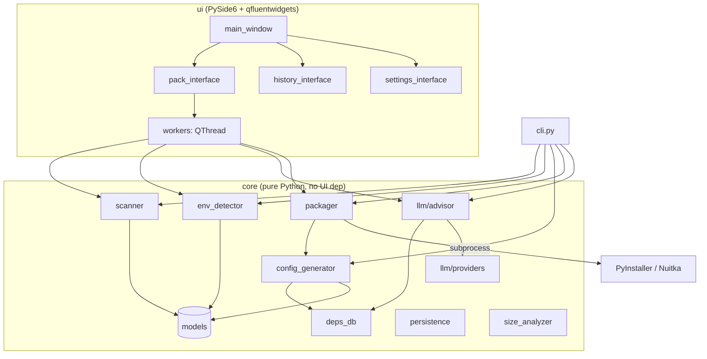

# PySmartPack · Smart Python Packager

 [中文](./README.md) · **English**

 📖 [DESIGN spec (English)](./DESIGN_EN.md) 

> A **thinking, modern front-end** for PyInstaller / Nuitka.
> Point it at a Python folder → it auto-detects structure / environment / dependencies / data → one-click build into an executable.

<p>


</p>

PySmartPack is **not** another packaging engine — it is a **smart configuration front-end** for PyInstaller / Nuitka, analogous to *Docker Desktop for the Docker CLI*.
It automates the long-standing pain points (writing `.spec` files, chasing hidden imports, collecting data files) while keeping the principle that **every auto-detected result stays editable** — it never decides silently for you.

---

## Table of Contents

- [🚀 How to Run (start here)](#-how-to-run-start-here)
- [What It Solves](#what-it-solves)
- [Features](#features)
- [UI Preview](#ui-preview)
- [How It Works / Architecture](#how-it-works--architecture)
- [Data Transparency & Privacy](#data-transparency--privacy) (**important**)
- [Installation](#installation)
- [Usage](#usage)
  - [GUI](#gui)
  - [CLI](#cli)
- [Detection Coverage](#detection-coverage)
- [LLM Advisor](#llm-advisor-optional)
- [Project Layout](#project-layout)
- [Development & Tests](#development--tests)
- [Build a Portable Release](#build-a-portable-release)
- [Roadmap](#roadmap)
- [FAQ](#faq)
- [Contributing](#contributing)
- [License](#license)
- [Changelog](#changelog)

> Related docs: UI / color spec in [DESIGN_EN.md](./DESIGN_EN.md) ([中文](./DESIGN.md)).

---

## 🚀 How to Run (start here)

> PySmartPack ships a **zero-dependency portable build** — like mpv: download, unzip, double-click. **End users do not need Python.**

### Option A · End users: download & run (recommended)
1. Download `PySmartPack_portable.zip` (~**50 MB**) from Releases.
2. Unzip anywhere.
3. Double-click **`PySmartPack.exe`** inside the folder → the GUI opens. **No Python, no dependencies.**

> Want to produce this zip yourself? See [Build a Portable Release](#build-a-portable-release) (one command).

### Option B · Developers: run from source
- **Windows**: double-click **`run.bat`** in the repo root (creates a venv and installs deps on first run, then launches the GUI).
- **macOS / Linux**: `bash run.sh`
- **Manual**:
  ```bash
  python -m venv .venv
  .venv\Scripts\activate          # Windows (macOS/Linux: source .venv/bin/activate)
  pip install -r requirements.txt
  python -m pysmartpack            # launch the GUI
  ```

---

## What It Solves

PyInstaller is powerful but fiddly to configure. Long-standing community pain points:

| Pain point | Traditional way | PySmartPack |
|---|---|---|
| Which file is the entry point? | Specify manually | Static `if __name__ == "__main__"` analysis + scoring |
| Data files (xlsx/npz/json…) get missed | Hand-write `--add-data` | Auto-classify by extension, selected by default, toggle off |
| Wrong deps packaged despite a venv/Conda | Activate the env manually | Auto-detect venv/conda/poetry and locate its interpreter |
| Dynamic imports / C-extensions missed | Trial and error after errors | AST detects dynamic imports, scans `.dll/.so/.pyd`, warns |
| Heavy libs (torch, …) fail to build | Google + guesswork | Built-in knowledge base auto-injects `--collect-all`, etc. |
| The build command is a black box | Opaque | One-click **preview** of CLI args and the `.spec` file |

---

## Features

Organized by milestone; all three milestones are implemented.

### M1 · Core packaging pipeline (end-to-end working)
- **Modern Fluent UI**: PySide6 + qfluentwidgets, dark theme, Linear-style design tokens (see [DESIGN_EN.md](./DESIGN_EN.md)).
- **Project scanner**: entry-point detection, package structure, data-file classification, dynamic-import & C-extension detection (pure `ast`, never executes the target code).
- **Environment detector**: venv / `.venv` / conda / poetry / pipenv, preferring the project's own interpreter `pip list` for real dependencies.
- **Config generator**: auto-generates PyInstaller args / `.spec`, turning data files into `--add-data` and binaries into `--add-binary`.
- **Packaging executor**: drives the backend in a subprocess, parses stdout in real time → progress bar + colored log, with cancel support.
- **Two packaging strategies**: `Bundle (PyInstaller)` or `Compile (Nuitka)`; output `onefile / onedir`.

### M2 · Smart differentiation
- **Dependency knowledge base (`deps_db`)**: built-in packaging fixes for numpy/pandas/scipy/sklearn/matplotlib/torch/tensorflow/opencv/PySide6/qfluentwidgets, etc. (hidden-import, collect-all, onedir advice).
- **LLM advisor (off by default)**: analyzes a project summary and recommends backend / output mode / hidden imports / data strategy; **DeepSeek by default**, also supports OpenAI / Anthropic / Ollama; **falls back to the local rule engine offline or on failure**.
- **Nuitka backend**: optional compile mode.

### M3 · Polish
- **Settings / history persistence**: recent projects, default options and LLM config are stored locally; packaging history can be viewed/cleared.
- **Output size analysis**: after a build, lists size share per subdir/file to find what bloated the bundle.
- **Portable build**: a one-command script `scripts/build_app.py` packages PySmartPack into a zero-dependency portable release (see [Build a Portable Release](#build-a-portable-release)).

---

## UI Preview


Three pages (left-hand Fluent navigation):

- **Pack**: ① pick a project → ② checkable scan-result tree → ③ packaging options + advice → progress bar + colored log → Build / Cancel / Open output / Preview command.
- **History**: a table of recent packaging jobs (name / backend / result / duration / project).
- **Settings**: LLM advisor toggle & credentials, dark/light theme.

---

## How It Works / Architecture

**Strict layering**: `core` is pure Python with zero UI dependency (reusable by GUI / CLI / CI and independently unit-tested); `ui` depends on `core` one-way.



### Module responsibilities

| Module | Responsibility | Key tech |
|---|---|---|
| `core/scanner.py` | Scan structure, entry, data files, import chain, dynamic imports, C-extensions | `ast`, `pathlib` (**read-only, no execution**) |
| `core/env_detector.py` | Detect the virtual env and resolve dependencies | `pyvenv.cfg`, `pip list`, `pyproject.toml`, `poetry env info` |
| `core/deps_db.py` | Knowledge base of common packaging pitfalls | rule table |
| `core/config_generator.py` | Scan result → `PackConfig` → CLI args / `.spec` / Nuitka command | templated rendering |
| `core/packager.py` | Run the backend subprocess, parse progress, cancel, locate output, choose interpreter | `subprocess.Popen` |
| `core/llm/` | Optional LLM advisor + rule fallback (DeepSeek/OpenAI/Anthropic/Ollama) | stdlib `urllib` HTTP |
| `core/persistence.py` | Local settings / history persistence | JSON @ user config dir |
| `core/size_analyzer.py` | Output size analysis | filesystem walk |
| `ui/*` | Fluent UI and `QThread` workers | PySide6, qfluentwidgets |

### Data flow of one build

```
pick folder
  → scanner.scan_project(path)        →  ScanResult (entry / packages / data / imports / dynamic / C-ext)
  → env_detector.detect_env(root)     →  EnvInfo (env kind / interpreter / deps)
  → llm.get_advice(scan, llm_cfg)     →  Advice (suggestions; local rules by default)
  → config_generator.build_pack_config(...)  →  PackConfig (add_data / hidden_imports / collect_*)
  → config_generator.render(cfg)      →  {args, spec}  ← shown by the "Preview" button
  → packager.Packager(cfg).run(...)   →  subprocess invokes PyInstaller/Nuitka
                                       →  live log + progress callbacks
                                       →  PackResult (success / output path / duration)
  → size_analyzer.analyze(output)     →  size report
  → persistence.add_history(...)      →  write local history
```

---

## Data Transparency & Privacy

Design principle: **local by default, offline by default, never silently uploads your code.**

### Where each kind of data goes

| Data | Leaves your machine? | Notes |
|---|---|---|
| Your source code | **Never** | The scanner only does `ast` static analysis; source is **not logged, not uploaded**. |
| Project structure summary | Only when you **enable LLM manually** | See the exact fields below. |
| Dependency / import names | Only when LLM is enabled | Module/dependency **names** only. |
| LLM API key | **Never leaves your machine** (except connecting to the API endpoint you configured) | Stored in plain text locally, used only for the auth header; always redacted as `***` in logs. |
| Settings / history | **Never** | JSON in the user config dir. |
| Build subprocess output | **Never** | Shown only in the local log pane. |

### When LLM is enabled, the **complete payload** sent to the model (from `core/llm/prompts.py::scan_summary`)

```jsonc
{
  "is_single_file": false,
  "entry_points": ["main.py"],          // filenames only, no paths
  "third_party_imports": ["numpy", ...],// top-level import names only
  "dynamic_imports": ["import_module"], // dynamic-import symbols
  "data_files": {"table": 2, "config": 1}, // counts only
  "has_c_extensions": true,
  "env": {"kind": "conda", "python": "3.11.2"}
}
```

> ⚠️ **Never sent**: source code, absolute file paths, data-file contents, API key, username/hostname.
> You can disable LLM anytime in *Settings* (it's off by default); then all advice comes from the **local rule engine** with zero network.

### Local file locations

| File | Windows | macOS | Linux |
|---|---|---|---|
| `settings.json` / `history.json` | `%APPDATA%\PySmartPack\` | `~/Library/Application Support/PySmartPack/` | `${XDG_CONFIG_HOME:-~/.config}/PySmartPack/` |

---

## Installation

> 💡 **End users can skip this**: just use the [portable build](#-how-to-run-start-here). The steps below are for developers / running from source.

### Requirements
- Python **3.9+** (developed and validated on 3.11)
- Windows / macOS / Linux (cross-platform code; fully validated on Windows)

### From source

```bash
git clone https://github.com/<your-name>/PySmartPack.git
cd PySmartPack

# 1) create & activate a virtual environment
python -m venv .venv
# Windows
.venv\Scripts\activate
# macOS / Linux
source .venv/bin/activate

# 2) install core dependencies
pip install -r requirements.txt

# 3) (recommended) editable install to get the `pysmartpack` command
pip install -e .
```

### Optional extras

```bash
pip install -e ".[nuitka]"   # compile-mode backend
pip install -e ".[llm]"      # LLM SDKs (note: the built-in HTTP client already works; this is optional)
pip install -e ".[dev]"      # tests / lint
```

---

## Usage

### GUI

```bash
pysmartpack          # or: python -m pysmartpack
```

Workflow:
1. **Pick a project**: click "Browse folder" (or "Pick file" for a single `.py`); scanning starts automatically.
2. **Review scan results**: confirm the entry script (check one) and uncheck any data files you don't want bundled.
3. **Set options**: *strategy* (Bundle/Compile), *output mode* (onefile/onedir), app name, console visibility.
4. **(Optional) Smart analysis**: click "Advice" for recommendations; click "Preview command / spec" to see the exact command.
5. **Build**: progress bar + live log; on success "Open output folder" and a size report in the log.

### CLI

> 💡 The CLI targets **source / `pip install`** users (run `pysmartpack` or `python -m pysmartpack` via Python).
> The portable `.exe` is **GUI-only** (windowed, double-click) and has no console; for a console binary, build a variant with `python scripts/build_app.py --console`.

```bash
# scan and print structure JSON (with rule-engine advice)
pysmartpack scan ./path/to/project --advice

# build: onefile with a custom name
pysmartpack pack ./path/to/project --onefile --name myapp

# compile mode (Nuitka), onedir, hide console, skip data files
pysmartpack pack ./app.py --backend nuitka --onedir --no-console --no-data
```

| Command / option | Description |
|---|---|
| `scan <path>` | Scan and print structure JSON |
| `scan ... --advice` | Include rule-engine packaging advice |
| `pack <path>` | Scan and build |
| `--name <n>` | App name (defaults to the entry filename) |
| `--backend pyinstaller\|nuitka` | Backend (default pyinstaller) |
| `--onefile` / `--onedir` | Output mode (auto-decided by heavy libs by default) |
| `--no-console` | Hide the console window (GUI apps) |
| `--no-data` | Don't bundle detected data files |
| `--version` | Version |

---

## Detection Coverage

- **Entry points**: scripts with `if __name__ == "__main__"`; names like `__main__.py/main.py/app.py/run.py/cli.py` get weighted; scored by directory depth.
- **Virtual environments**: `venv` / `.venv` / `env` (with `pyvenv.cfg`), `conda` (`environment.yml`/`conda-meta`), `poetry` (`poetry.lock`/`[tool.poetry]`), `pipenv` (`Pipfile`).
- **Dependency sources** (priority): project interpreter `pip list` → `requirements.txt` → `pyproject.toml` (PEP 621) → `[tool.poetry]`.
- **Data-file categories**: tables (`csv/xlsx/parquet…`), models/arrays (`npz/npy/pkl/pt/onnx/h5/safetensors…`), config (`json/yaml/toml/ini…`), docs, media/assets (`png/svg/ttf/qss…`), databases (`db/sqlite`), native extensions (`dll/so/dylib/pyd`).
- **Risk warnings**: dynamic imports (`__import__`/`importlib.import_module`), C-extensions, files with syntax errors, missing entry point.
- **Knowledge base covers**: numpy, pandas, scipy, sklearn, matplotlib, PIL, cv2, torch, tensorflow, transformers, pywin32, cryptography, lxml, jinja2, flask, django, sqlalchemy, pydantic, qfluentwidgets, qframelesswindow, openai, anthropic, etc.

---

## LLM Advisor (optional)

**Off by default.** Enable it in *Settings* and provide credentials (default provider is **DeepSeek**):

| Provider | Typical model | Base URL | Notes |
|---|---|---|---|
| `deepseek` ⭐ default | `deepseek-chat` (V3) / `deepseek-reasoner` (R1) | `https://api.deepseek.com` (auto-filled if blank) | OpenAI-compatible, JSON mode; key at platform.deepseek.com |
| `openai` | `gpt-4o-mini` | official by default, override for compatible endpoints | |
| `anthropic` | `claude-3-5-sonnet-latest` | official by default | |
| `ollama` | `llama3.1` | `http://localhost:11434` | local, no key |

- Only the [structure summary](#data-transparency--privacy) is sent — never source code.
- Any failure (no network / invalid key / timeout) **falls back gracefully** to the local rule engine; the build is unaffected.

---

## Project Layout

```
PySmartPack/
├─ app_main.py             # frozen/build entry (used by scripts/build_app.py)
├─ run.bat / run.sh        # one-click run from source (auto venv + launch GUI)
├─ pyproject.toml          # packaging / deps / entry scripts
├─ requirements.txt        # core runtime dependencies
├─ README.md / README_EN.md     # Chinese / English docs (cross-linked)
├─ DESIGN.md / DESIGN_EN.md     # Chinese / English design spec (cross-linked)
├─ LICENSE / .gitignore
├─ .github/workflows/build.yml  # CI: 3-platform build + auto Release on tag
├─ img/screenshot.jpg           # UI screenshot
├─ scripts/
│  └─ build_app.py         # one-click portable build (+ slimming + zip)
├─ src/pysmartpack/
│  ├─ __main__.py          # python -m pysmartpack entry
│  ├─ cli.py               # headless CLI (scan / pack)
│  ├─ core/                # pure Python core (no UI dep)
│  │  ├─ models.py  scanner.py  env_detector.py
│  │  ├─ deps_db.py  config_generator.py  packager.py
│  │  ├─ persistence.py  size_analyzer.py
│  │  └─ llm/ (advisor.py, providers.py, prompts.py)
│  └─ ui/                  # PySide6 + qfluentwidgets
│     ├─ theme.py  workers.py  main_window.py  app.py
│     └─ pack_interface.py  settings_interface.py  history_interface.py
├─ tests/                  # pytest (28 cases)
└─ examples/               # single_file / multi_package / data_heavy sample projects
```

> Build outputs `dist/` and `build/` are in `.gitignore` and not committed.

---

## Development & Tests

```bash
pip install -e ".[dev]"

pytest -q                 # run unit tests (28, core layer, no display needed)
ruff check src tests      # style check

python -m pysmartpack            # launch GUI
python -m pysmartpack scan examples/multi_package --advice  # validate the core pipeline
```

> The core layer is fully decoupled from the UI, so CI can test all business logic without a graphical environment.

---

## Build a Portable Release

One command produces a **zero-dependency** portable build (the script bundles Qt/Fluent resources and slims the size):

```bash
python scripts/build_app.py            # portable folder + PySmartPack_portable.zip (recommended)
python scripts/build_app.py --onefile  # single .exe (slower start, larger)
python scripts/build_app.py --icon app.ico   # custom icon
python scripts/build_app.py --fat      # don't exclude any Qt module (only for troubleshooting missing modules)
```

Artifacts (verified to run standalone, no Python needed):

| Form | Path | Size (measured) |
|---|---|---|
| Portable folder | `dist/PySmartPack/` | ~123 MB |
| **Portable zip** | `dist/PySmartPack_portable.zip` | **~50 MB** |
| Single file | `dist/PySmartPack.exe` (`--onefile`) | larger, slower start |

Ship `PySmartPack_portable.zip`; users unzip and double-click `PySmartPack.exe`.
By default the script excludes unused Qt modules (WebEngine / Quick / 3D / Charts / Multimedia), cutting size from ~580 MB to ~123 MB.

### Continuous Integration / Auto-release

The repo ships a GitHub Actions workflow (`.github/workflows/build.yml`):

- **Tag to release**: push a tag like `v0.1.0` → builds the portable bundle in parallel on **Windows / macOS / Linux** and creates a GitHub Release with the per-platform zips (macOS ships a `.app`).
- Can also be triggered manually from the repo *Actions* tab (`workflow_dispatch`).

Cut a release:

```bash
git tag v0.1.0
git push origin v0.1.0
```

---

## Roadmap

- [ ] Incremental packaging / build cache
- [ ] Installer generation (MSI / DMG / AppImage)
- [ ] Code-signing integration (`signtool` / `codesign`)
- [ ] Cross / containerized cross-platform builds
- [ ] Two-way `.spec` editing (import an existing spec)
- [ ] i18n UI

---

## FAQ

**Q: `ModuleNotFoundError` after building?**
A: Usually a dynamic import or an uncommon library. Check the hidden-import hints in "Advice", or add `--hidden-import` in the preview. Known libraries are handled automatically by `deps_db`.

**Q: Why use my project's interpreter instead of PySmartPack's own?**
A: Only your project's env has your third-party dependencies. If PyInstaller isn't installed there, you'll get a clear warning and a fallback to the bundled interpreter (third-party deps may be missing then).

**Q: Do I need network / a key?**
A: No. LLM is off by default; all advice comes from the local rule engine, fully offline.

**Q: onefile or onedir?**
A: onefile is handier for lightweight projects; onedir starts faster and is more robust for heavy libs like torch/opencv (the tool advises automatically).

---

## Contributing

PRs / Issues welcome. Please ensure: `pytest` passes, `ruff` is clean, and add tests for new `core` features. To add a "known library pitfall", extend `core/deps_db.py`.

## License

[MIT](./LICENSE)

---

## Changelog

- **2026-06-20** — **Bilingual docs**: README / DESIGN split into Chinese & English (`*_EN.md`) with a language switcher cross-linked at the top for international reach; facts synced (28 tests, project layout tree, `qframelesswindow` added to the knowledge base).
- **2026-06-20** — **Portable / zero-dependency release**: added `scripts/build_app.py` one-click build (PyInstaller, auto-collects qfluentwidgets/qframelesswindow resources, slims unused Qt modules, auto-produces `*_portable.zip`), `app_main.py` frozen entry, `run.bat`/`run.sh` one-click run; `deps_db` qfluentwidgets upgraded to `collect_all` plus a new qframelesswindow entry. Measured portable zip ~50 MB, unzip-and-run, no Python; verified to launch standalone.
- **2026-06-20** — **DeepSeek first-class**: added `DeepSeekClient` (OpenAI-compatible, `https://api.deepseek.com`, `deepseek-chat`/`deepseek-reasoner`, JSON mode) and made it the default LLM provider; settings and defaults updated; 5 new unit tests (28 total, all passing).
- **2026-06-20** — Initial v0.1.0: three milestones complete (core pipeline / knowledge base + LLM advisor + Nuitka / persistence + size analysis + portable build); PySide6+qfluentwidgets Fluent UI; CLI (scan/pack); end-to-end validated (built and ran a real `.exe`). Fixed Windows GBK-console log `UnicodeEncodeError`.
